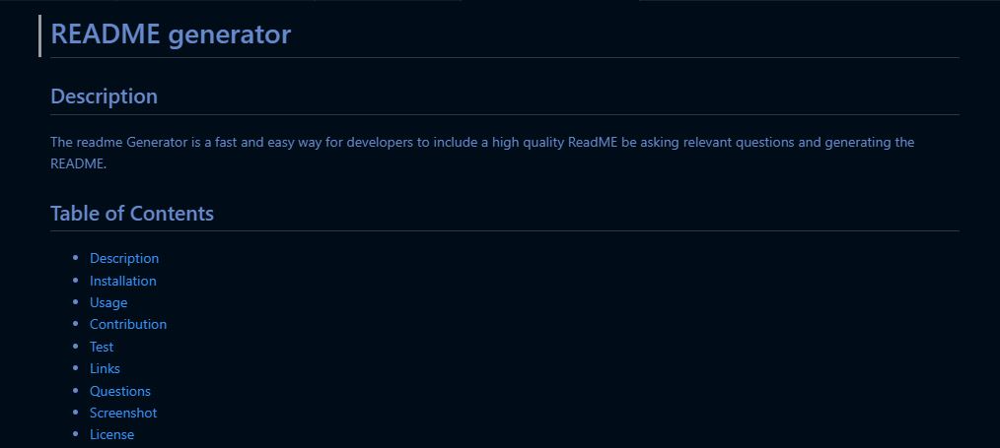

# README generator

 

## Description
The readme Generator is a fast and easy way for developers to include a high quality ReadME be asking relevant questions and generating the README.

## Table of Contents
* [Description](#description)
* [Installation](#installation)
* [Usage](#usage)
* [Contribution](#contribution)
* [Test](#test)
* [Links](#links)
* [Questions](#questions)
* [Screenshot](#screenshot)
* [License](#license)

## Installation
To run this project, i had to run NPM init -y and NPM install inquirer@8.2.4

## Usage
To use the generator, run Node index.js in your terminal.

## Contribution
n/a

## Test
n/a

## Questions
You can reach me with questions at Example@AOL.com.
GitHub: OliveraDiaz

## Links
Video link: https://watch.screencastify.com/v/cQu8Abe6JE9xTMpi9uNW
Github link: https://github.com/OliveraDiaz/ReadMEGen.git

## Screenshot

